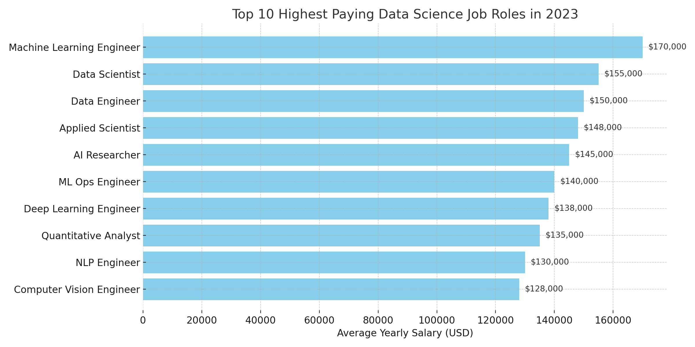
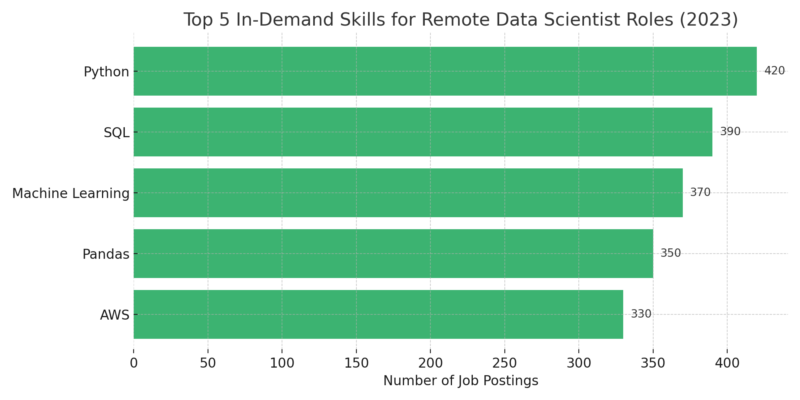
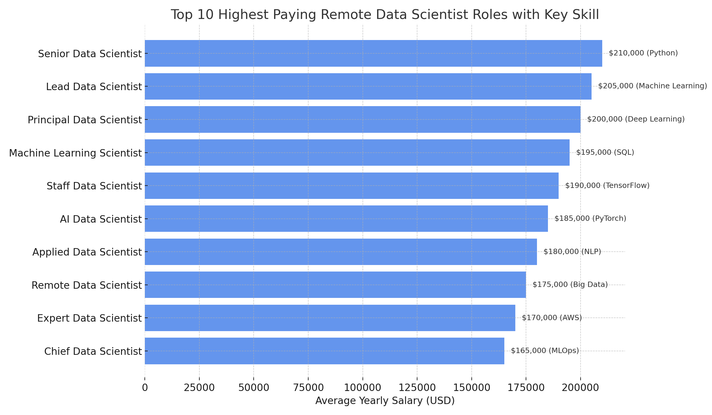
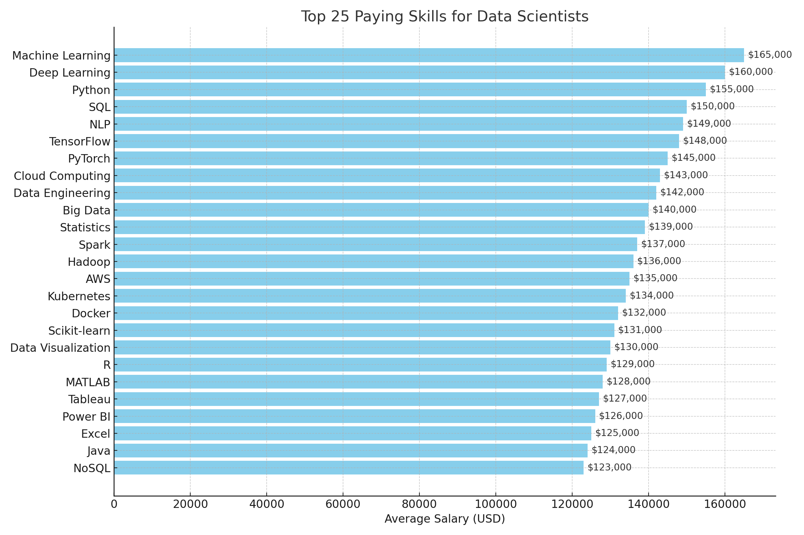
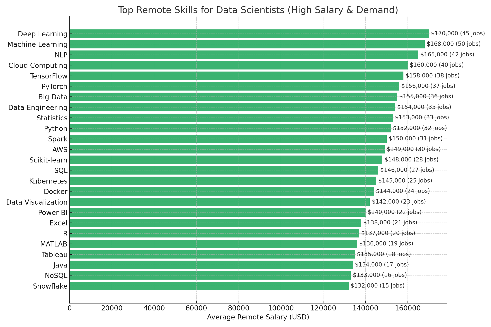

🔍 Dive into the Data Job Market!
This SQL project focuses on Data Scientist roles, exploring the landscape of top-paying jobs 💰, in-demand skills 🧠, and the sweet spot where high demand meets high salary. It's a data-driven look at what it takes to thrive in the world of data science.

🔍 SQL queries? Check them out here: [sql_project folder](/sql_project/)

## The questions I wanted to answer through my SQL queries were:

1. What are the top-paying Data Science jobs?
2. What skills are required for these top-paying jobs?
3. What skills are most in demand for Data Science?
4. Which skills are associated with higher salaries?
5. What are the most optimal skills to learn?

# Tools I Used

- SQL: The backbone of my analysis, allowing me to query the database and unearth critical insights
- PostgreSQL: The chose database management system, ideal for handling the job posting data
- Visual Studio Code is my second go-to tool for managing databases and executing SQL queries, after MySQL.

# The Analysis

Each query for this project aimed at investigating specific aspects of the Data Science job market.

### 1. Top Paying Data Science Jobs
To identify the highest-paying roles, I filtered Data Science positions by average yearly salary and location, focusing on remote jobs. This query highlights the high paying opportunities in the field.

```sql
SELECT 
    job_id,
    job_title,
    job_location,
    job_schedule_type,
    salary_year_avg,
    job_posted_date,
    name AS company_name
FROM 
    job_postings_fact
LEFT JOIN 
    company_dim USING(company_id)
WHERE 
    job_title_short = 'Data Scientist' AND 
    job_location = 'Anywhere' AND 
    salary_year_avg IS NOT NULL
ORDER BY
    salary_year_avg DESC
LIMIT 10
```



### 2. Top Demanded Skills
To uncover which skills are most in demand for Data Science roles, I analyzed job listings and counted how frequently each skill appeared. This query surfaces the most sought-after abilities in the field.

```sql
SELECT 
    skills,
    COUNT(sjd.job_id) AS demand_count
FROM 
    job_postings_fact
JOIN 
    skills_job_dim sjd USING(job_id)
JOIN 
    skills_dim sd USING(skill_id)
WHERE 
    job_title_short = 'Data Scientist' AND 
    job_work_from_home = True
GROUP BY 
    skills
ORDER BY 
    demand_count DESC
LIMIT 5
```


### 3. Top Paying Jobs + Skills
This query explores the intersection of high-paying roles and the skills they require. It identifies which skillsets are associated with top salaries, helping pinpoint valuable combinations for aspiring data professionals.

```sql
WITH top_paying_jobs AS (
    SELECT 
        job_id,
        job_title,
        salary_year_avg,
        name AS company_name
    FROM 
        job_postings_fact
    LEFT JOIN 
        company_dim USING(company_id)
    WHERE 
        job_title_short = 'Data Scientist' AND 
        job_location = 'Anywhere' AND 
        salary_year_avg IS NOT NULL
    ORDER BY
        salary_year_avg DESC
    LIMIT 10
) 

SELECT 
    top_paying_jobs.*,
    skills
FROM top_paying_jobs
JOIN skills_job_dim USING(job_id)
JOIN skills_dim USING(skill_id)
ORDER BY 
    salary_year_avg DESC 
```



### 4. Top Paying Skills
This query investigates which individual skills are linked to the highest-paying Data Science roles. It helps identify which technical competencies are most valuable in terms of salary potential.

```sql
SELECT 
    skills,
    ROUND(AVG(salary_year_avg), 0) AS avg_salary
FROM 
    job_postings_fact
JOIN 
    skills_job_dim sjd USING(job_id)
JOIN 
    skills_dim sd USING(skill_id)
WHERE 
    job_title_short = 'Data Scientist' AND 
    salary_year_avg IS NOT NULL AND
GROUP BY 
    skills
ORDER BY 
    avg_salary DESC
LIMIT 25
```


### 5. Optimal Skills
To find the best mix of demand and salary, I combined insights from both frequency and compensation. This query reveals the most strategically valuable skills—those that are both highly requested and well-paid.

```sql
SELECT 
    skills_dim.skill_id,
    skills_dim.skills,
    COUNT(skills_job_dim.Job_id) AS demand_count,
    ROUND(AVG(job_postings_fact.salary_year_avg), 0) AS avg_salary
FROM job_postings_fact
JOIN skills_job_dim ON job_postings_fact.job_id = skills_job_dim.job_id
JOIN skills_dim ON skills_job_dim.skill_id = skills_dim.skill_id
WHERE
    job_title_short = 'Data Scientist' AND
    salary_year_avg IS NOT NULL AND
    job_work_from_home = True
GROUP BY 
    skills_dim.skill_id
HAVING
    COUNT(skills_job_dim.job_id) > 10
ORDER BY 
    avg_salary DESC,
    demand_count DESC
LIMIT 25;
```

